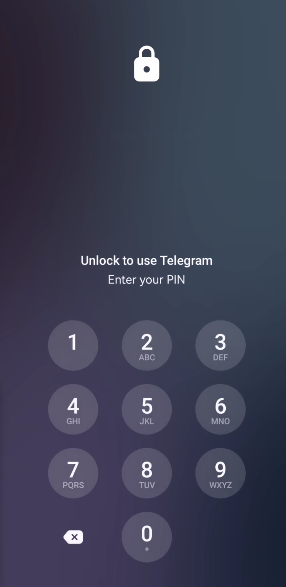
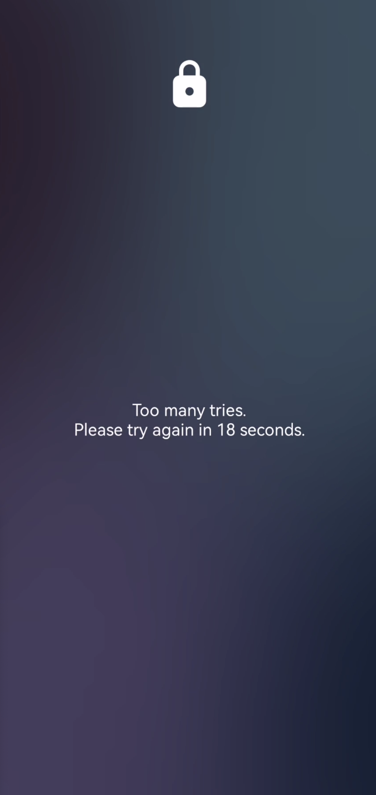

# 🛠️ Telegram 4-Digits PIN Brute-Force Tool

This tool is a Python script designed for a home CTF lab environment to brute-force a 4-digit PIN in a modified Telegram app on an Android device using ADB and coordinate taps. It respects a 31-second countdown on failure, detects success or the countdown via OCR on frames recorded from `scrcpy`, and resumes from the last attempted PIN if interrupted.

## 🚀 Features

-   🔓 Brute-forces PINs from `0000` to `9999`, resuming from the last attempt.
-   👆 Simulates keypad taps using confirmed coordinates.
-   📹 Records the screen via `scrcpy`, extracts frames with `ffmpeg`, and uses OCR with `pytesseract` to confirm the countdown.
-   🎨 Logs attempts with colors and emojis for readability.
-   ⚙️ Handles interruptions, errors, and unconfirmed countdowns (marked as `ERROR-COUNTDOWN` for manual review).

## 🖼️ Screenshots

Below are two example screenshots (one before a PIN attempt and one after).

<div style="display:flex; gap:12px; align-items:flex-start;">
  <div style="text-align:center;">
    
    <div>Before attempt</div>
  </div>
  <div style="text-align:center;">
    
    <div>After attempt</div>
  </div>
</div>

## 📋 Requirements

-   📱 Android device with USB debugging enabled.
-   💻 PC with ADB, `scrcpy`, `ffmpeg`, Tesseract-OCR, and Python 3.
-   💿 Supported operating systems: macOS, Windows, Linux.

## ⚙️ Installation

Refer to the step-by-step guide below for OS-specific setup.

## ▶️ Usage

1.  Save the script as `pin4brute.py`.
2.  Update the configuration (e.g., `KEYPAD_COORDS`, `DELAY`) if necessary.
3.  Run the script:

    -   **macOS/Linux:**
        ```bash
        python3 pin4brute.py
        ```
    -   **Windows:**
        ```bash
        python pin4brute.py
        ```

The script will start from the last attempted PIN (or `0000`) and log progress.
Stop it with `Ctrl+C`; it will resume next time.

## 📝 Log File

-   **`pin_attempts.log`**: Records each PIN attempt with timestamps and status (e.g., `ERROR-COUNTDOWN` for unconfirmed cases).

## 🎨 Customization

-   Adjust `countdown_keywords` in `ocr_countdown` for specific text.
-   Crop the image in `ocr_countdown` for better OCR accuracy.
-   Change `DELAY` if the countdown varies.

## 📖 Step-by-Step Guide to Using the Tool

This guide covers mobile device setup and PC configuration for macOS, Windows, and Linux. The tool uses ADB to interact with the device, `scrcpy` to record the screen, `ffmpeg` to extract frames, and `pytesseract` for OCR to detect countdowns.

### Step 1: 📱 Set Up the Mobile Device (Android)

This is the same across operating systems.

1.  **Enable Developer Options:**
    -   Go to **Settings > About phone**.
    -   Tap "Build number" 7 times until "You are now a developer!" appears.

2.  **Enable USB Debugging:**
    -   Go to **Settings > System > Developer options**.
    -   Enable "USB debugging".
    -   Connect your phone to the PC via USB.
    -   On the phone, allow USB debugging for the PC (check "Always allow from this computer").

3.  **Install the Telegram App (if not already installed):**
    -   Download and install Telegram from the Play Store or an APK (for a modified version in a CTF lab).
    -   Open the app and navigate to the PIN screen.

### Step 2: 💻 Set Up the PC

Follow the instructions for your operating system.

#### macOS Setup 🍎

1.  **Install Homebrew** (package manager):
    Open Terminal and run:
    ```bash
    /bin/bash -c "$(curl -fsSL https://raw.githubusercontent.com/Homebrew/install/HEAD/install.sh)"
    ```

2.  **Install ADB:**
    ```bash
    brew install android-platform-tools
    ```
    Verify:
    ```bash
    adb version
    ```

3.  **Install scrcpy:**
    ```bash
    brew install scrcpy
    ```
    Verify:
    ```bash
    scrcpy --version
    ```

4.  **Install ffmpeg:**
    ```bash
    brew install ffmpeg
    ```
    Verify:
    ```bash
    ffmpeg -version
    ```

5.  **Install Tesseract-OCR:**
    ```bash
    brew install tesseract
    ```
    Verify the path (e.g., `/usr/local/bin/tesseract`).

6.  **Install Python and Packages:**
    Install Python 3 from python.org or Homebrew:
    ```bash
    brew install python
    ```
    Install packages:
    ```bash
    pip3 install pure-python-adb pytesseract pillow
    ```
    Verify:
    ```bash
    python3 -c "import pure_python_adb; import pytesseract; import PIL; print('OK')"
    ```

#### Windows Setup 🪟

1.  **Install ADB:**
    -   Download the Android SDK Platform Tools from the official Android site.
    -   Extract the ZIP to a folder (e.g., `C:\platform-tools`).
    -   Add it to `PATH`: Right-click **This PC > Properties > Advanced system settings > Environment Variables > System variables > Path > Edit > New** -> `C:\platform-tools`.
    -   Verify in Command Prompt:
        ```cmd
        adb version
        ```

2.  **Install scrcpy:**
    -   Download from GitHub: https://github.com/Genymobile/scrcpy/releases
    -   Extract the ZIP to a folder (e.g., `C:\scrcpy`).
    -   Add it to `PATH` (similar to ADB).
    -   Verify in Command Prompt:
        ```cmd
        scrcpy --version
        ```

3.  **Install ffmpeg:**
    -   Download from the official site (get a Windows build from gyan.dev or BtbN).
    -   Extract to a folder (e.g., `C:\ffmpeg`).
    -   Add it to `PATH`.
    -   Verify:
        ```cmd
        ffmpeg -version
        ```

4.  **Install Tesseract-OCR:**
    -   Download from GitHub: https://github.com/UB-Mannheim/tesseract/wiki
    -   Install the executable (e.g., `tesseract-ocr-w64-setup-5.4.0.20240606.exe`).
    -   Add it to `PATH` (e.g., `C:\Program Files\Tesseract-OCR`).
    -   Verify:
        ```cmd
        tesseract --version
        ```

5.  **Install Python and Packages:**
    -   Download Python 3 from python.org and install (check "Add Python to PATH").
    -   Install packages in Command Prompt:
        ```cmd
        pip install pure-python-adb pytesseract pillow
        ```
    -   Verify:
        ```cmd
        python -c "import pure_python_adb; import pytesseract; import PIL; print('OK')"
        ```

#### Linux Setup (Ubuntu/Debian-based) 🐧

1.  **Install ADB:**
    ```bash
    sudo apt update
    sudo apt install adb
    ```
    Verify:
    ```bash
    adb version
    ```

2.  **Install scrcpy:**
    ```bash
    sudo apt install scrcpy
    ```
    Verify:
    ```bash
    scrcpy --version
    ```

3.  **Install ffmpeg:**
    ```bash
    sudo apt install ffmpeg
    ```
    Verify:
    ```bash
    ffmpeg -version
    ```

4.  **Install Tesseract-OCR:**
    ```bash
    sudo apt install tesseract-ocr
    ```
    Verify:
    ```bash
    tesseract --version
    ```

5.  **Install Python and Packages:**
    ```bash
    sudo apt install python3 python3-pip
    ```
    Install packages:
    ```bash
    pip3 install pure-python-adb pytesseract pillow
    ```
    Verify:
    ```bash
    python3 -c "import pure_python_adb; import pytesseract; import PIL; print('OK')"
    ```

### Step 3: 🚀 Run the Tool

1.  **Download or Copy the Script:**
    -   Save the `pin4brute.py` script provided on your PC.

2.  **Update the Script if Necessary:**
    -   Open the script in a text editor.
    -   Adjust `KEYPAD_COORDS`, `DELAY`, or paths (e.g., `SCRCPY_PATH`, `FFMPEG_PATH`, `TESSERACT_PATH`) if they differ on your system (e.g., on Windows use full paths like `C:\\scrcpy\\scrcpy.exe`).

3.  **Start the Script:**
    In Terminal/Command Prompt:
    -   **macOS/Linux:**
        ```bash
        python3 pin4brute.py
        ```
    -   **Windows:**
        ```bash
        python pin4brute.py
        ```
    The script will connect to the device, start from the last PIN (or `0000`), and perform the brute force.

4.  **Interruption and Resumption:**
    -   Press `Ctrl+C` to stop; it will log the last PIN and resume from there next time.
    -   Check `pin_attempts.log` to see progress and any `ERROR-COUNTDOWN` entries for manual review.

5.  **Verification:**
    -   Monitor the console for colors and emojis indicating status.
    -   If a PIN succeeds, verify it manually (e.g., that the app unlocks).

### Step 4: ✅ Verification and Troubleshooting

-   **100% Confirmation**: The script detects the countdown via OCR, but if OCR fails it marks it as `ERROR-COUNTDOWN` for manual review. Test with known incorrect PINs to see if the OCR detects the countdown text.
-   **Common Issues**:
    -   **Recording hangs**: Adjust `timeout` or `--max-size` in `record_screen`.
    -   **OCR does not detect text**: Add cropping in `ocr_countdown` or adjust keywords.
    -   **Device not found**: Ensure USB debugging is enabled and the cable is properly connected.
    -   **Paths**: Update script paths for Windows/Linux if executables are not in `PATH`.
-   **Cleanup**:
    -   Remove `temp.mp4`, `frame.png`, and `pin_attempts.log` if you start over.

This setup should work on macOS, Windows, and Linux. If you encounter OS-specific issues, let me know for further adjustments.

> ⚠️ [!WARNING] ⚠️
> **DO NOT USE THIS TOOL OUTSIDE A CONTROLLED CTF OR LABORATORY ENVIRONMENT!**
>
> This script is designed for educational purposes only within a home Capture The Flag (CTF) lab. Using it on real Telegram accounts, unauthorized devices, or outside a controlled environment is **illegal, unethical, and a violation of Telegram's Terms of Service**. Doing so may result in account bans, legal consequences, or other serious repercussions.
>
> **⚠️ Tip: Be cautious! ⚠️**
>
> Think before you act. Respect privacy, laws, and the rights of others. Misuse of this tool is your responsibility, and the author is not liable for any damage or legal issues caused by improper use. Use it wisely and only in an authorized, safe context.

### License
This project is licensed under the [MIT License](LICENSE) - see the [LICENSE](LICENSE) file for details.
